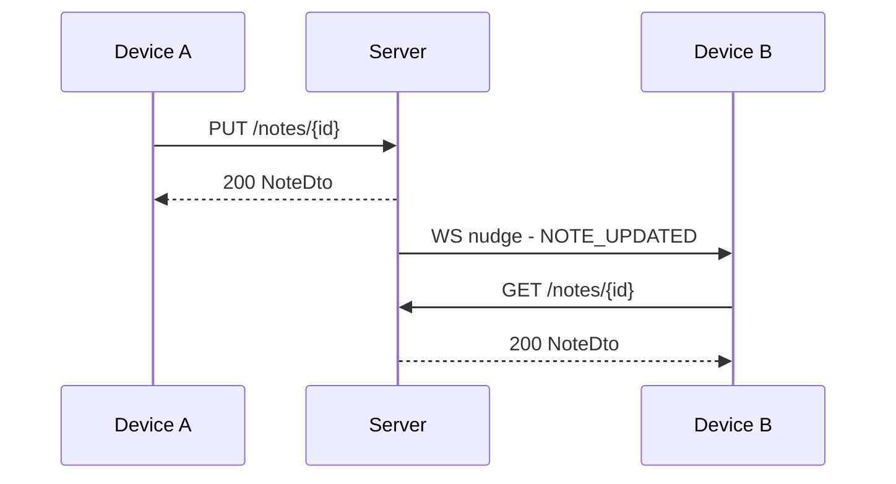
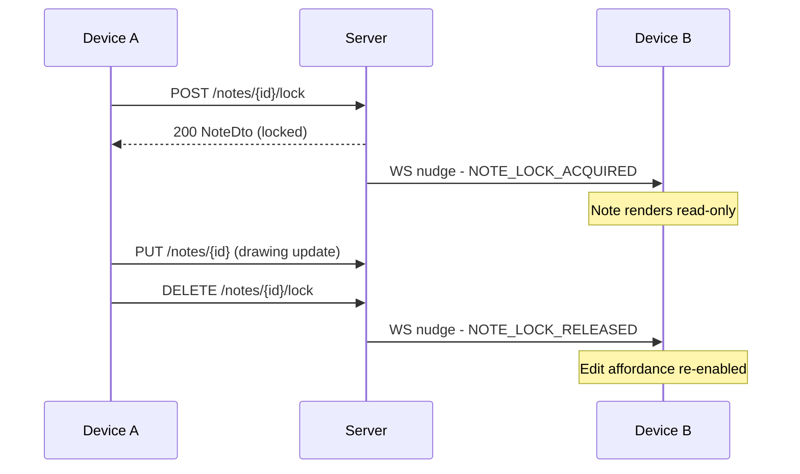

# Sync Protocol
Created: 08/07/2026 Last updated: 08/07/2026

## Overview
This document describes how delta sync and the WebSocket nudge signals work together — the flow, not the wire contracts. Endpoints, DTOs, and event types are defined elsewhere and only referenced here by name.

## Owns:
- The delta sync flow (client-initiated pull, triggered by launch or a WS nudge).
- The WS nudge → REST pull sequence, including the drawing edit-lock flow.
- Conflict resolution behavior (last-write-wins) and its consequence for version history.
- Reconnect behavior after a dropped WebSocket connection.

## Does not own:
- REST endpoint definitions (method, path, status codes) — see `../api/endpoints.md`. This doc references endpoints by name only and never redefines them.
- DTO field shapes — see `../api/schemas.md`.
- The WS nudge type table — see `../api/events.md`.

## Related documentation:
- [../api/endpoints.md](../api/endpoints.md)
- [../api/schemas.md](../api/schemas.md)
- [../api/events.md](../api/events.md)
- [responsibilities.md](responsibilities.md)
- `decisions/` — cross-repo ADRs affecting this flow

### Content

#### Delta sync flow
Last updated: 08/07/2026

The client calls `GET /notes/sync` (see `endpoints.md`) on launch and on reconnect after a dropped WebSocket connection, passing `SyncRequestDto` as query params (see `schemas.md`). The server returns `SyncResponseDto` — notes changed since `lastSyncedAt`, plus any note IDs soft-deleted in that window. The client stores the returned `serverTime` as its new `lastSyncedAt` once the response is applied.

#### Real-time nudge flow
Last updated: 08/07/2026

Between sync pulls, the WebSocket connection (`/ws/sync`, see `events.md`) delivers nudge signals — `NOTE_UPDATED`, `NOTE_DELETED`, `NOTE_RESTORED` — that tell a client something changed without carrying the changed content itself. The client reacts by pulling the affected note over REST.

#### Drawing edit-lock flow
Last updated: 08/07/2026

The lock mechanic (`POST`/`DELETE /notes/{id}/lock`, see `endpoints.md`) exists so two devices never write conflicting drawing strokes to the same note. One device claims the lock; others render read-only until it's released.

#### Conflict resolution
Last updated: 08/07/2026

Last-write-wins by server `lastModifiedAt` is the only conflict model CacheIt uses — there is no client-side merge UI and no version-hash comparison. The losing edit isn't discarded: it's preserved as a version history entry (30-day retention, see `../api/database.md`). A client never needs to prompt the user to resolve a conflict directly; version history is the recovery path instead.

#### Reconnect behavior
Last updated: 08/07/2026

Nudge delivery is fire-and-forget — a client that's offline simply misses nudges outright. On reconnect, the client always runs a full delta sync before resubscribing to nudges, which covers whatever was missed. Lock state specifically is **not** covered by delta sync — a client reconnecting mid-lock should check `lockedByDeviceId` on the note directly (via `GET /notes`) rather than rely on having received the original `NOTE_LOCK_ACQUIRED` nudge. Offline writes queue locally and sync once connectivity returns; exact retry timing and local storage mechanics are a per-client implementation detail, not specified here.